---
title: 萌新也能学会的自制mod教程（文字 + 图片版）
type: reference
kind: tutorial
status: active
version: "v1.0"
tags:
  - bg3
  - 教程
created: 2026-10-03
updated: 2026-10-03
---

# 萌新也能学会的自制mod教程

> [!info] 这份文件的来源
> 由作者提供的第三方教程 `.docx` 转换而来，**图片按原文顺序保留**。
> 原教程的关键内容大量存在于图片中，纯文字版会丢失信息，故一并转换。
> 
> 原 `.docx` 与 `.pdf` 均在 `reference\tutorials\` 下。
> 教程为**第三方作者**所写，非本工程原创，仅供自用参考。
> 
> **注意**：教程写于较早版本，部分内容与当前实测不符。
> 遇到冲突以 ModMaker 仓库的 `2-工作流\Stats语法与结构.md` 与
> ModMaker 仓库的 `2-工作流\Stats字段字典.md` 的实测结论为准。

---


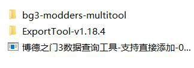


# 萌新也能学会的自制 mod 教程
你是否玩腻了本体的装备？你是否想拥有 一件自己的武器 or 护甲 or 饰品？你是否因好看的
装备不强力或者强力的装备不好看而感到 烦恼？私以为对博德之门3mod 制作还颇有心得，
奈何网上的教程非常之少而且较为繁琐，官方 mod 制作工具还全是英文而且及其难用，我
来开个帖子来教大家如何制作自己的专属 装备。
前排提示，本贴里 mod 的基础框架，所使用的三个工具，以及示范 mod 我都会打包发在
评论区。
0.前言：mod 制作要用的三个工具，已经打包好放到文 件夹里。

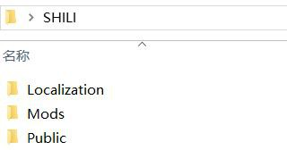


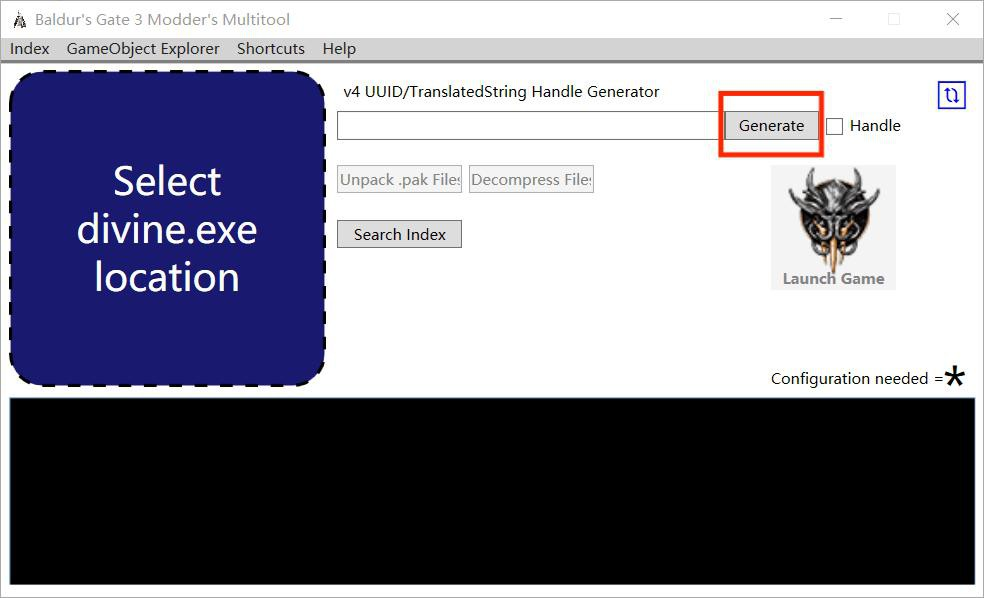


# 一.mod 的基础框架
Mod 的基础框架我已经给大家弄好了
那么简单介绍一下
主文件夹名字 SHILI（示例）
Localization 文件夹，里面是汉化文件，可以修改或自定义文本描述，如果不想改可以不要
Mods 文件夹，里面的东西在 step2 里介绍
Public 文件夹。我们主要修改的地方，包括装备 属性，外观，被动等，下面再详细介绍。

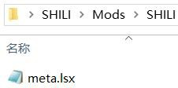


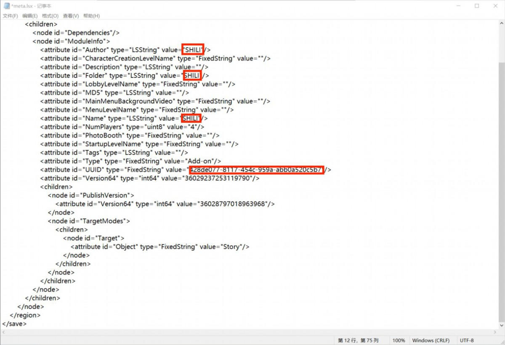


# Step3
打开 mods 文件夹里的这个 txt 文件
打开之后里面为
并把图上的这个字符串改成上一步生成的 uuid，
保存关闭。
至此 mod 的基础框架就完成了。

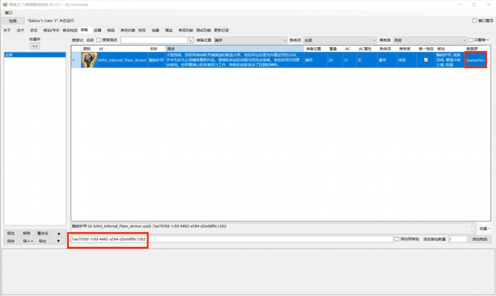


# 二.修改装备属性
针对装备修改有两种方式，一种是修改原有装备的属性，另一种是新建一件装备。前者更加
快捷方便，缺点是七号补丁之后改装备的名字和描述 不知道为啥失效了（有懂的大佬可以教
教我）后者优点是可以自定义名字和描述 ，但是较为麻烦。
先介绍第一种，直接修改原有装备属性。
以黯狱护甲为例

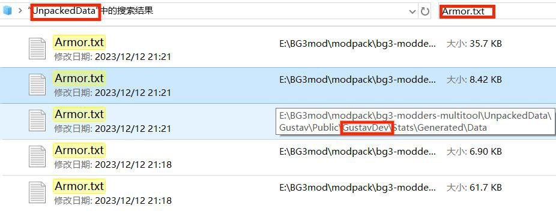


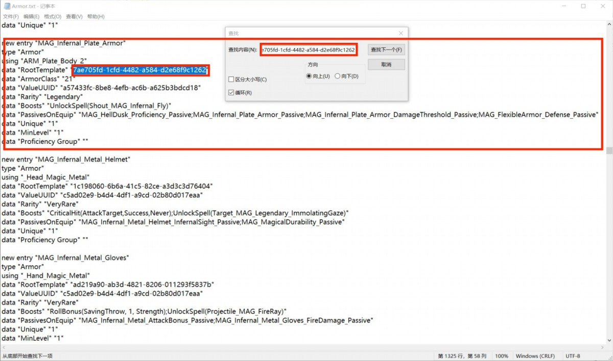

Step2 右上角数据源那里代表装备在哪个文件夹。这些需要解包的数据我都已经给大家解
好了，在三个工具文件里的 bg3-modders-multitool\UnpackedData。在这个文件夹里搜
索，我这里是修改护甲所以搜索 Armor.txt,要是武器就是 Weapon.txt,以此类推。
会有一共五个文件，我们找到位于 Gustavdev 里的 txt 文件，此处的 Gustavdev 就是数据
查询工具里的数据源。以此类推，和 Gustavdev 同级的还有 Gustav，Shared，SharedDev
以及 Hornor。最后这个是荣誉模式专属不必去管他。其他四个包含了所有装备的数据，他
们里面都有 Weapon，Armor 等分类，我们只需要找到数据查询工具 里相对应的就行，比
如长剑+2 就是在 Shared 文件夹里的 weapon 里。
Step3 打开搜索到的 Armor.txt,搜索黯狱护甲的 UUID，并且把红框处的文本复制下来

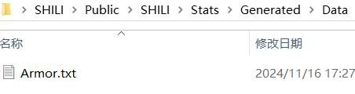


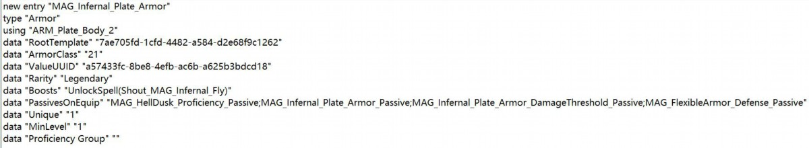

Step4 回到你的 mod 文件夹，打开里面的 Public，找到里面的 Data 文件夹，然后新建一
个 Armor.txt，武器就是 Weapon.txt。实测你把武器的数据放到 Armor 里也能识别，甚至
被动 Passive 等也可以，但是为了保险起见请分开。然后将刚才复制的东西粘贴到刚刚新建
的 txt 里

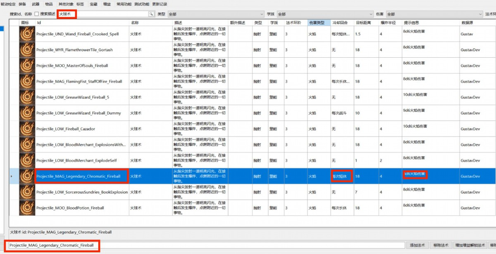

比如我想把此装备的飞行术改成火球术， 那么在数据查询工具里搜索火球术
可以看见这里是游戏里所有火球术，需要指出的是装备提供的法术都不需要法 术位。这些火

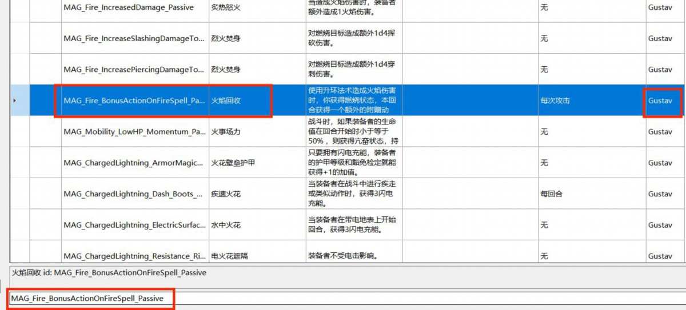

再如果我想改装备被动，那么在数据查询工具里找你想要的被动，比如说我想要这个火焰回
收被动
data"PassivesOnEquip"
"MAG_HellDusk_Proficiency_Passive;MAG_Infernal_Plate_Armor_Passive;MAG_Infer
nal_Plate_Armor_DamageThreshold_Passive;MAG_FlexibleArmor_Defense_Passive"

# 装备被动
修改成
data"PassivesOnEquip" "MAG_Fire_BonusActionOnFireSpell_Passive"装备被动
不同的被动用分号隔开，注意一定要用英 文的分号。

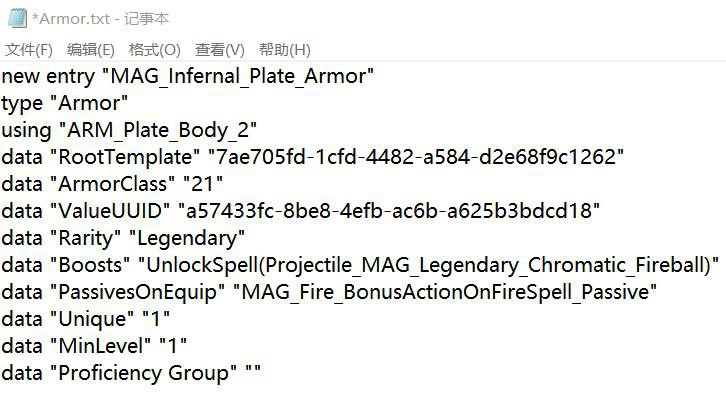

修改之后
其实最好的方式是你想要哪件装备的效果，就去搜对应装备的文本，然后扒下来有用的。为了方
便大家本文的最后有附录专门介绍词条。

# 三.修改被动
基础步骤和上面装备的差不多，参考修改装备属性里的步骤，在数据查询工具里找到想修改的被
动，再参考上一条的 step2，搜索 Passive.txt，把里面的词条都复制下来，再在新建 Armor.txt
的文件夹里新建一个 Passive.txt,然后粘贴进去。
例子：火焰回收：MAG_Fire_BonusActionOnFireSpell_Passive
new entry "MAG_Fire_BonusActionOnFireSpell_Passive"被动名字
type "PassiveData"类型
data "DisplayName" "h882f26e1g5702g4d33g835cgd8aef161b3bb;2"被动在游戏里的名字
data "Description" "ha52eda16g7787g4edfg8adbg567579ada73c;4"描述文本

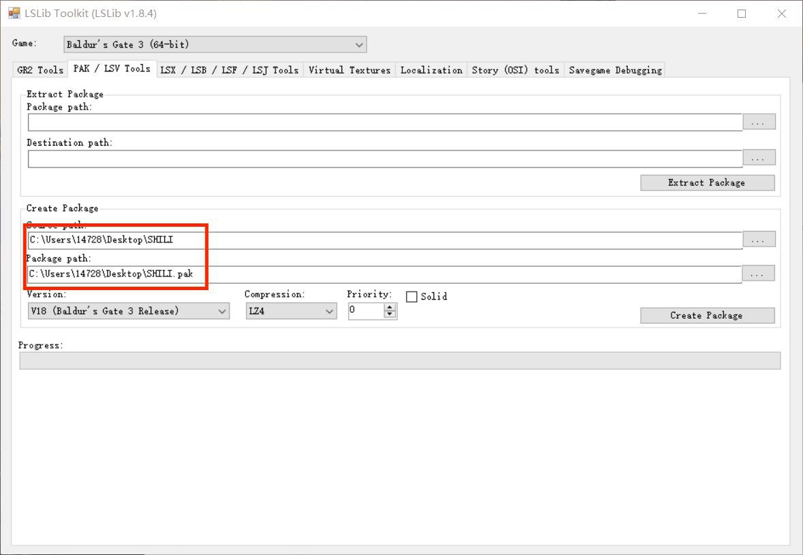


# 四.封包
最后就得用我们的第三个工具，ExportTool-v1.18.4，打开之后运行 exe 文件
下面这两栏就是封包，同理上面那两栏是解包，下载的别人的 mod 可以通过这里变成文件夹形
package 就可以打包成 pak 格式的 mod 文件了。

# 附录：词条解释
以下词条若无特殊标注添加到稀有度词条之下生效。
注：以 data "Boosts"都写成一个词条，用分号隔开，比如添加法术和技能：
参考文献
https://bbs.3dmgame.com/thread-6442806-1-1.html
https://bbs.3dmgame.com/thread-6448218-1-1.html
https://bbs.3dmgame.com/thread-6411709-1-1.html